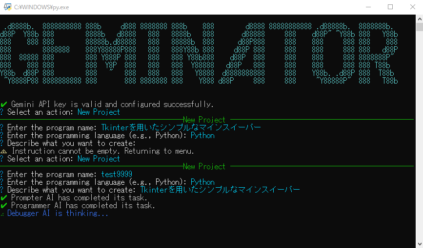
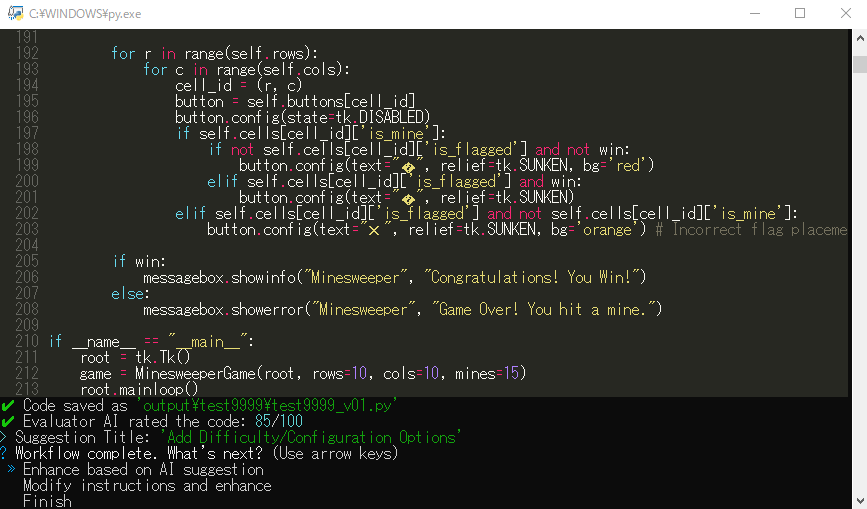

# Geminator: AI-Powered Code Generation Framework

Geminatorは、複数の専門AIエージェント（Prompter, Programmer, Debugger, Refactorer, Evaluator）が連携し、ユーザーの指示に基づいてコードを生成、デバッグ、リファクタリング、評価するインタラクティブなフレームワークです。




## Features

* **マルチエージェントワークフロー:** 複数のAIが協調し、高品質なコードを段階的に生成します。
* **対話的CLI:** `questionary`と`rich`ライブラリを活用し、直感的で分かりやすいユーザーインターフェースを提供します。
* **新規作成と機能拡張:** 新しいプロジェクトの立ち上げから、既存コードの改善・機能追加まで対応します。
* **自動実行モード:** AIによる評価スコアが目標に達するまで、改善サイクルを自律的に繰り返す「Auto-Mode」を搭載しています。
* **柔軟な設定:** 各AIエージェントが使用するモデルを`.env`ファイルで個別に設定可能です。

## Requirements

* Python 3.8+
* Google Gemini API Key
* `prompts`ディレクトリと各AIロールのプロンプトファイル

## Installation

1. **リポジトリをクローンします。**

    ```bash
    git clone https://github.com/your-username/geminator.git
    cd geminator
    ```

2. **必要なPythonライブラリをインストールします。**
    依存関係を`requirements.txt`に記述し、インストールしてください。

    `requirements.txt`:

    ```txt
    google-generativeai
    questionary
    python-dotenv
    rich
    ```

    ```bash
    pip install -r requirements.txt
    ```

3. **プロンプトファイルを作成します。**
    `prompts`ディレクトリを作成し、以下の5つのファイルに各AIエージェントの指示（システムプロンプト）を記述してください。
    * `prompts/prompter.txt`
    * `prompts/programmer.txt`
    * `prompts/debugger.txt`
    * `prompts/refactorer.txt`
    * `prompts/evaluator.txt`

4. **APIキーを設定します。**
    スクリプトを初めて実行すると、`.env`ファイルが自動的に作成され、APIキーの入力を求められます。指示に従ってキーを入力してください。

## Usage

1. **Geminatorを起動します。**

    ```bash
    python Geminator/main.py
    ```

2. **メニューから操作を選択します。**
    * **New Project:** 新しいコードをゼロから生成します。
    * **Enhance Project:** `output`ディレクトリ内の既存のコードを改善します。
    * **Settings:** AIモデルや自動モードの設定を変更します。
    * **Exit:** アプリケーションを終了します。

## License

This project is licensed under the MIT License - see the [LICENSE](LICENSE) file for details.
